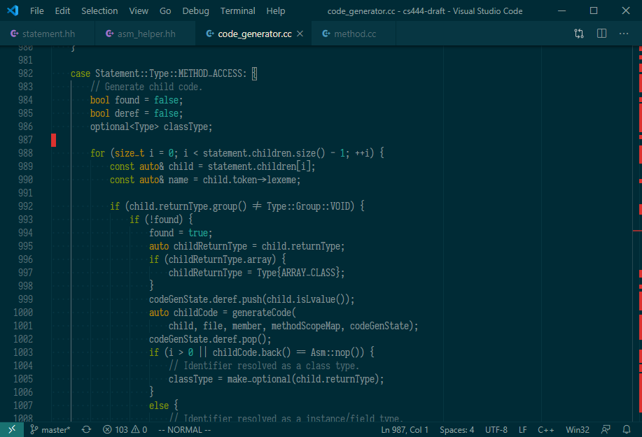

# Solarized Dark Vim

Tries to be accurate to the vim version of Solarized Dark. Themes editor and UI.

Currently optimized for the following languages:

- C/C++
- JavaScript/React
- Markdown
- Python
- Shell script

Contains minimal additional highlighting. The theme uses no italics, bold, etc. for code.
