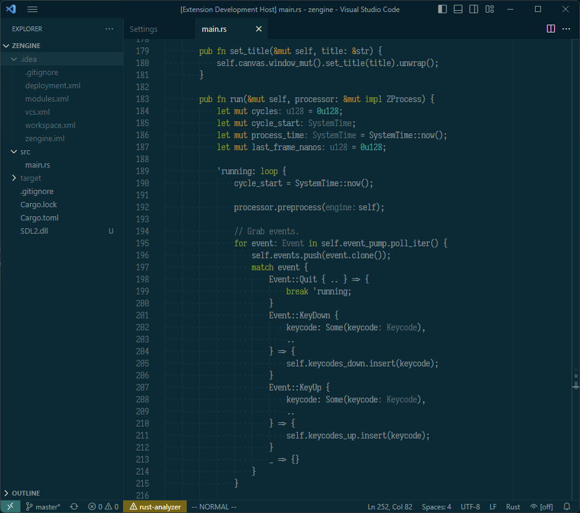
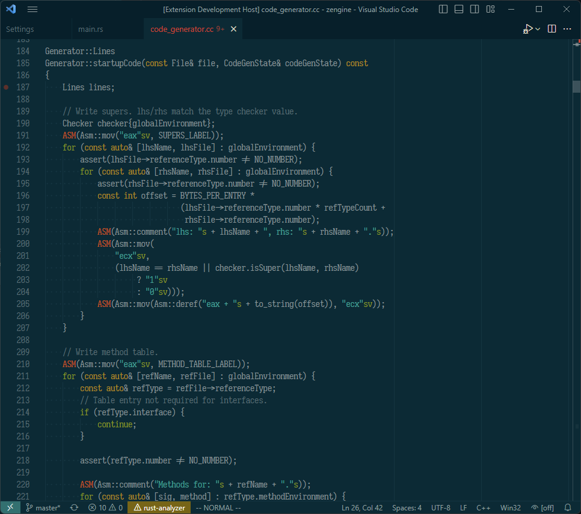

# Solarized Dark Vim

Stays true to the vim "feel" of Solarized Dark, using similar colours where possible. Tweaks are made to preserve accuracy across languages and to reduce the number of special colours used.

Themes editor and UI. Currently optimized for the following languages:

- C/C++
- JavaScript/TypeScript/React
- Markdown
- Python
- Rust
- Shell script

The following languages are also supported, but with fewer optimizations:

- CMake
- Go
- LaTeX/TeX
- Lua
- Java

Contains minimal additional highlighting. The theme uses no italics, bold, etc. for code.

Feel free to open an issue if you would like to see something changed!
